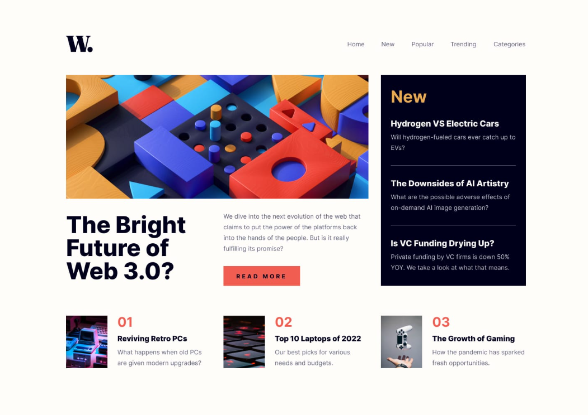

# News Homepage Project

➡[View live site]](https://news-homepage-ochre-two.vercel.app/)

## Project Description

This project is a responsive news homepage built with HTML and CSS. It features a clean, modern design with a focus on readability and user experience. The layout includes a header with navigation, a featured article section, a news sidebar with the latest articles, and a numbered articles section.

## How to View the Project

To view the project, simply open the `index.html` file in any modern web browser. The page is designed to be responsive and works well on desktop devices.

## Project Structure

- `index.html`: The main HTML file containing the structure of the news homepage.
- `index.css`: The CSS file that styles the HTML elements and layout.
- `assets/`: Contains images and icons used throughout the project.
- `design/`: Contains design reference images such as desktop and mobile mockups, and active states.

## Design Standards

This project follows the design guidelines outlined in the `style-guide.md` file, which includes:

- Layout widths for mobile (375px) and desktop (1440px)
- Color palette with primary and neutral colors
- Typography using the Inter font family with specified font sizes and weights

## Technologies Used

- HTML5
- CSS3
- Google Fonts (Inter)

## Author

Maxmillin
